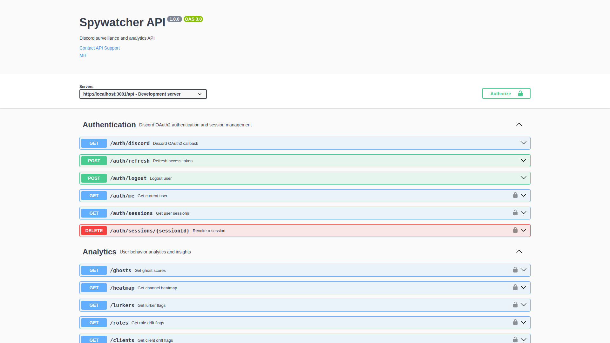
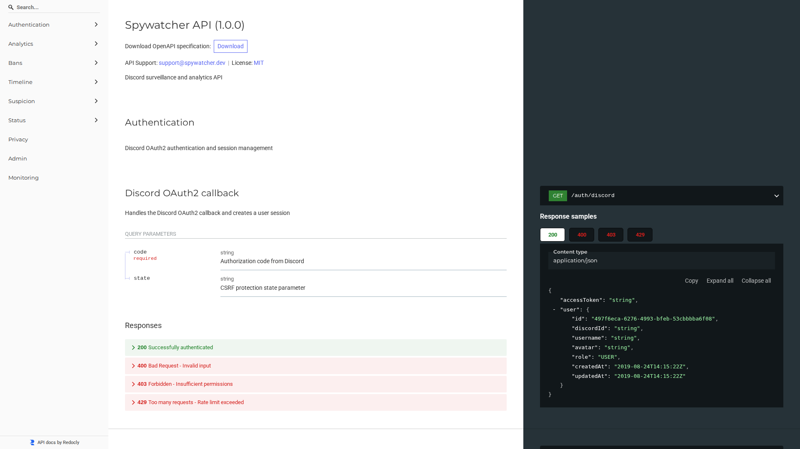
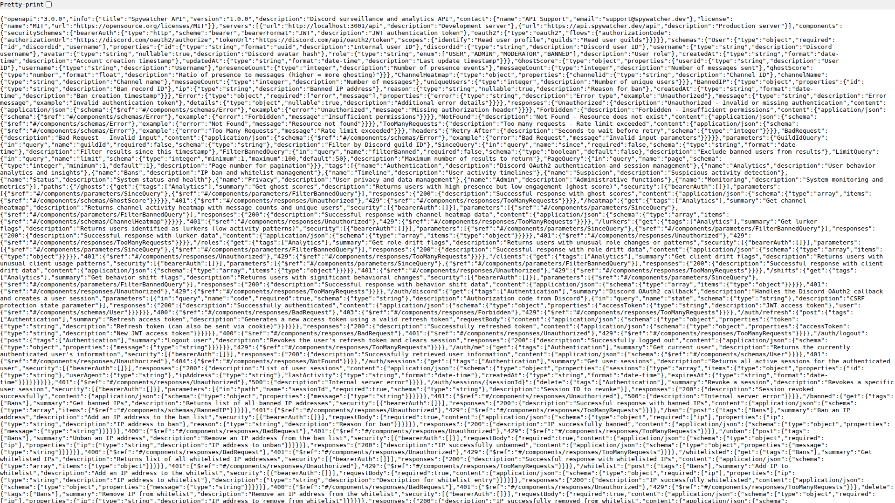

# API Documentation

This document describes how to access and use the Spywatcher API documentation.


*Screenshot of Swagger UI - Interactive API documentation interface*

## Interactive Documentation

### Swagger UI (Recommended for Testing)

The interactive Swagger UI is available at:

```
http://localhost:3001/api/docs
```

**Features:**
- Interactive "Try it out" functionality
- Test API endpoints directly from the browser
- Authentication testing with JWT tokens
- Request/response examples
- Schema validation

**How to use:**
1. Navigate to `/api/docs` in your browser
2. Click "Authorize" button to add your JWT Bearer token
3. Expand any endpoint to see details
4. Click "Try it out" to test the endpoint
5. Fill in parameters and click "Execute"

### ReDoc (Clean Documentation View)


*Screenshot of ReDoc - Clean, professional documentation view*

An alternative, cleaner documentation view is available at:

```
http://localhost:3001/api/redoc
```

**Features:**
- Clean, professional appearance
- Better for reading and understanding API structure
- Mobile-friendly responsive design
- Print-friendly format
- Three-panel design with navigation

## OpenAPI Specification


*Screenshot of OpenAPI JSON specification*

The raw OpenAPI 3.0 specification is available at:

```
http://localhost:3001/api/openapi.json
```

This JSON file can be used to:
- Generate client SDKs in various languages
- Import into API testing tools (Postman, Insomnia)
- Integrate with API gateways
- Generate documentation in other formats

## API Overview

### Base URL

**Development:** `http://localhost:3001/api`  
**Production:** `https://api.spywatcher.dev/api`

### Authentication

Most endpoints require authentication using JWT Bearer tokens:

```
Authorization: Bearer <your-jwt-token>
```

To obtain a token:
1. Authenticate via Discord OAuth2: `GET /api/auth/discord?code=<code>`
2. Use the returned `accessToken` in subsequent requests

### Rate Limiting

The API implements rate limiting to prevent abuse:
- **Global rate limit:** Applied to all `/api` routes
- **Analytics endpoints:** Stricter limits for resource-intensive operations
- **Auth endpoints:** Separate limits for authentication operations

Rate limit headers are included in responses:
- `X-RateLimit-Limit`: Maximum requests allowed
- `X-RateLimit-Remaining`: Requests remaining in window
- `X-RateLimit-Reset`: Time when the limit resets

## API Categories

### Authentication (`/api/auth/*`)
User authentication, session management, and OAuth2 flows.

**Key endpoints:**
- `GET /auth/discord` - Discord OAuth2 callback
- `POST /auth/refresh` - Refresh access token
- `GET /auth/me` - Get current user info
- `POST /auth/logout` - Logout user
- `GET /auth/sessions` - List user sessions
- `DELETE /auth/sessions/{sessionId}` - Revoke a session

### Analytics (`/api/*`)
User behavior analytics and insights.

**Key endpoints:**
- `GET /ghosts` - Get ghost scores (high presence, low engagement)
- `GET /heatmap` - Channel activity heatmap
- `GET /lurkers` - Identify lurkers
- `GET /roles` - Role drift analysis
- `GET /clients` - Client usage patterns
- `GET /shifts` - Behavior shift detection

### Bans (`/api/*`)
IP ban and whitelist management.

**Key endpoints:**
- `GET /banned` - List banned IPs
- `POST /ban` - Ban an IP address
- `POST /unban` - Unban an IP address
- `GET /whitelisted` - List whitelisted IPs
- `POST /whitelist` - Add IP to whitelist
- `DELETE /whitelist` - Remove IP from whitelist

### Suspicion (`/api/suspicion/*`)
Suspicious activity detection and analysis.

**Key endpoints:**
- `GET /suspicion` - Get suspicion scores
- `GET /suspicion/{userId}` - Detailed user suspicion analysis

### Timeline (`/api/timeline/*`)
User activity timelines.

**Key endpoints:**
- `GET /timeline/{userId}` - Get user activity timeline

### Status (`/api/status`, `/health/*`)
System status and health checks.

**Key endpoints:**
- `GET /status` - Current system status (public)
- `GET /health/live` - Liveness probe (for orchestrators)
- `GET /health/ready` - Readiness probe (checks dependencies)

## Common Response Codes

- `200 OK` - Successful request
- `400 Bad Request` - Invalid input parameters
- `401 Unauthorized` - Missing or invalid authentication
- `403 Forbidden` - Insufficient permissions
- `404 Not Found` - Resource not found
- `429 Too Many Requests` - Rate limit exceeded
- `500 Internal Server Error` - Server error
- `503 Service Unavailable` - Service temporarily unavailable

## Error Response Format

All error responses follow a consistent format:

```json
{
  "error": "Error Type",
  "message": "Detailed error message",
  "details": {
    // Optional additional error details
  }
}
```

## Client SDK Generation

You can generate client SDKs from the OpenAPI specification using tools like:

### OpenAPI Generator

```bash
# Install OpenAPI Generator
npm install @openapitools/openapi-generator-cli -g

# Generate TypeScript client
openapi-generator-cli generate \
  -i http://localhost:3001/api/openapi.json \
  -g typescript-fetch \
  -o ./generated-client

# Generate Python client
openapi-generator-cli generate \
  -i http://localhost:3001/api/openapi.json \
  -g python \
  -o ./generated-client
```

### Swagger Codegen

```bash
# Generate Java client
swagger-codegen generate \
  -i http://localhost:3001/api/openapi.json \
  -l java \
  -o ./generated-client
```

## Postman Collection

To import the API into Postman:

1. Open Postman
2. Click "Import"
3. Select "Link"
4. Enter: `http://localhost:3001/api/openapi.json`
5. Click "Continue" and then "Import"

## Additional Resources

- [OpenAPI Specification](https://swagger.io/specification/)
- [Swagger UI Documentation](https://swagger.io/tools/swagger-ui/)
- [ReDoc Documentation](https://redocly.com/redoc/)

## Support

For API support or questions:
- Email: support@spywatcher.dev
- GitHub Issues: [subculture-collective/discord-spywatcher](https://github.com/subculture-collective/discord-spywatcher/issues)
