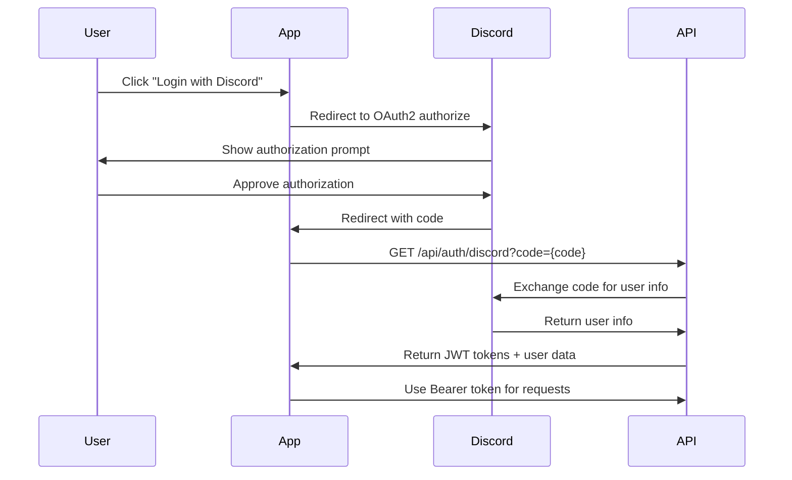

# Authentication Guide

This guide explains how to authenticate with the Spywatcher API using Discord OAuth2.

## Overview

The Spywatcher API uses **Discord OAuth2** for authentication and **JWT Bearer tokens** for API authorization.

### Authentication Flow



## Step 1: Register Your Application

1. Go to [Discord Developer Portal](https://discord.com/developers/applications)
2. Click **"New Application"**
3. Give your app a name
4. Navigate to **OAuth2** section
5. Add redirect URLs (e.g., `http://localhost:5173/auth/callback`)
6. Note your **Client ID** and **Client Secret**

## Step 2: Configure Environment Variables

Add these to your `.env` file:

```env
# Discord OAuth2 Configuration
DISCORD_CLIENT_ID=your_client_id_here
DISCORD_CLIENT_SECRET=your_client_secret_here
DISCORD_REDIRECT_URI=http://localhost:5173/auth/callback

# JWT Configuration
JWT_SECRET=your_jwt_secret_min_32_chars
JWT_REFRESH_SECRET=your_refresh_secret_min_32_chars
JWT_ACCESS_EXPIRES_IN=15m
JWT_REFRESH_EXPIRES_IN=7d
```

**Important Security Notes:**
- Never commit secrets to version control
- Use different secrets for development and production
- Generate secrets using: `openssl rand -hex 32`
- Rotate secrets regularly

## Step 3: Implement OAuth2 Flow

### Frontend Implementation

#### Option 1: Redirect Flow (Recommended)

```typescript
// Login button handler
function handleDiscordLogin() {
  const clientId = import.meta.env.VITE_DISCORD_CLIENT_ID;
  const redirectUri = 'http://localhost:5173/auth/callback';
  const scopes = ['identify', 'guilds'];
  
  const authUrl = `https://discord.com/oauth2/authorize?` +
    `client_id=${clientId}&` +
    `redirect_uri=${encodeURIComponent(redirectUri)}&` +
    `response_type=code&` +
    `scope=${scopes.join('%20')}`;
  
  window.location.href = authUrl;
}

// Callback handler (at /auth/callback route)
async function handleCallback() {
  const urlParams = new URLSearchParams(window.location.search);
  const code = urlParams.get('code');
  
  if (!code) {
    console.error('No authorization code received');
    return;
  }
  
  try {
    const response = await fetch(`http://localhost:3001/api/auth/discord?code=${code}`, {
      method: 'GET',
      credentials: 'include' // Important for cookies
    });
    
    if (!response.ok) {
      throw new Error('Authentication failed');
    }
    
    const data = await response.json();
    
    // Store tokens
    localStorage.setItem('accessToken', data.accessToken);
    localStorage.setItem('refreshToken', data.refreshToken);
    
    // Redirect to dashboard
    window.location.href = '/dashboard';
  } catch (error) {
    console.error('Authentication error:', error);
  }
}
```

#### Option 2: Popup Flow

```typescript
function openDiscordAuth() {
  const clientId = import.meta.env.VITE_DISCORD_CLIENT_ID;
  const redirectUri = 'http://localhost:5173/auth/callback';
  const scopes = ['identify', 'guilds'];
  
  const authUrl = `https://discord.com/oauth2/authorize?` +
    `client_id=${clientId}&` +
    `redirect_uri=${encodeURIComponent(redirectUri)}&` +
    `response_type=code&` +
    `scope=${scopes.join('%20')}`;
  
  const popup = window.open(
    authUrl,
    'Discord OAuth2',
    'width=500,height=700'
  );
  
  // Listen for message from popup
  window.addEventListener('message', async (event) => {
    if (event.origin !== window.location.origin) return;
    
    if (event.data.type === 'DISCORD_AUTH_CODE') {
      const code = event.data.code;
      popup?.close();
      
      // Exchange code for tokens
      const response = await fetch(`http://localhost:3001/api/auth/discord?code=${code}`);
      const data = await response.json();
      
      // Store tokens
      localStorage.setItem('accessToken', data.accessToken);
      localStorage.setItem('refreshToken', data.refreshToken);
    }
  });
}
```

### Backend API Call

The backend endpoint handles the OAuth2 flow automatically:

```
GET /api/auth/discord?code={authorization_code}
```

**Response:**
```json
{
  "accessToken": "eyJhbGciOiJIUzI1NiIsInR5cCI6IkpXVCJ9...",
  "refreshToken": "eyJhbGciOiJIUzI1NiIsInR5cCI6IkpXVCJ9...",
  "user": {
    "id": "uuid-here",
    "discordId": "123456789012345678",
    "username": "YourUsername",
    "discriminator": "1234",
    "avatar": "a_1234567890abcdef",
    "role": "USER",
    "createdAt": "2024-01-01T00:00:00.000Z"
  }
}
```

## Step 4: Using Access Tokens

### Making Authenticated Requests

Include the JWT token in the Authorization header:

```typescript
async function makeAuthenticatedRequest(endpoint: string) {
  const accessToken = localStorage.getItem('accessToken');
  
  const response = await fetch(`http://localhost:3001/api${endpoint}`, {
    method: 'GET',
    headers: {
      'Authorization': `Bearer ${accessToken}`,
      'Content-Type': 'application/json'
    }
  });
  
  return response.json();
}

// Example: Get current user
const user = await makeAuthenticatedRequest('/auth/me');

// Example: Get analytics
const ghosts = await makeAuthenticatedRequest('/ghosts?guildId=123456');
```

### Axios Interceptor

```typescript
import axios from 'axios';

const api = axios.create({
  baseURL: 'http://localhost:3001/api'
});

// Request interceptor
api.interceptors.request.use(
  (config) => {
    const token = localStorage.getItem('accessToken');
    if (token) {
      config.headers.Authorization = `Bearer ${token}`;
    }
    return config;
  },
  (error) => {
    return Promise.reject(error);
  }
);

// Response interceptor for token refresh
api.interceptors.response.use(
  (response) => response,
  async (error) => {
    const originalRequest = error.config;
    
    if (error.response?.status === 401 && !originalRequest._retry) {
      originalRequest._retry = true;
      
      try {
        const refreshToken = localStorage.getItem('refreshToken');
        const response = await axios.post(
          'http://localhost:3001/api/auth/refresh',
          { refreshToken }
        );
        
        const { accessToken, refreshToken: newRefreshToken } = response.data;
        
        localStorage.setItem('accessToken', accessToken);
        localStorage.setItem('refreshToken', newRefreshToken);
        
        originalRequest.headers.Authorization = `Bearer ${accessToken}`;
        return api(originalRequest);
      } catch (refreshError) {
        // Refresh failed, redirect to login
        localStorage.removeItem('accessToken');
        localStorage.removeItem('refreshToken');
        window.location.href = '/login';
        return Promise.reject(refreshError);
      }
    }
    
    return Promise.reject(error);
  }
);

export default api;
```

## Step 5: Token Refresh

Access tokens expire after 15 minutes. Use the refresh token to get a new access token:

```typescript
async function refreshAccessToken() {
  const refreshToken = localStorage.getItem('refreshToken');
  
  if (!refreshToken) {
    throw new Error('No refresh token available');
  }
  
  const response = await fetch('http://localhost:3001/api/auth/refresh', {
    method: 'POST',
    headers: {
      'Content-Type': 'application/json'
    },
    body: JSON.stringify({ refreshToken })
  });
  
  if (!response.ok) {
    throw new Error('Token refresh failed');
  }
  
  const data = await response.json();
  
  localStorage.setItem('accessToken', data.accessToken);
  localStorage.setItem('refreshToken', data.refreshToken);
  
  return data.accessToken;
}
```

### Automatic Token Refresh

```typescript
// Check token expiration before each request
function isTokenExpired(token: string): boolean {
  try {
    const payload = JSON.parse(atob(token.split('.')[1]));
    const exp = payload.exp * 1000; // Convert to milliseconds
    return Date.now() >= exp - 60000; // Refresh 1 minute before expiry
  } catch {
    return true;
  }
}

async function getValidAccessToken(): Promise<string> {
  let accessToken = localStorage.getItem('accessToken');
  
  if (!accessToken || isTokenExpired(accessToken)) {
    accessToken = await refreshAccessToken();
  }
  
  return accessToken;
}
```

## Step 6: Logout

### Client-Side Logout

```typescript
async function logout() {
  const accessToken = localStorage.getItem('accessToken');
  
  try {
    await fetch('http://localhost:3001/api/auth/logout', {
      method: 'POST',
      headers: {
        'Authorization': `Bearer ${accessToken}`,
        'Content-Type': 'application/json'
      },
      credentials: 'include'
    });
  } catch (error) {
    console.error('Logout error:', error);
  } finally {
    // Clear local storage
    localStorage.removeItem('accessToken');
    localStorage.removeItem('refreshToken');
    
    // Redirect to login
    window.location.href = '/login';
  }
}
```

## Session Management

### List Active Sessions

```typescript
async function listSessions() {
  const accessToken = localStorage.getItem('accessToken');
  
  const response = await fetch('http://localhost:3001/api/auth/sessions', {
    method: 'GET',
    headers: {
      'Authorization': `Bearer ${accessToken}`,
      'Content-Type': 'application/json'
    }
  });
  
  return response.json();
}
```

### Revoke Specific Session

```typescript
async function revokeSession(sessionId: string) {
  const accessToken = localStorage.getItem('accessToken');
  
  const response = await fetch(`http://localhost:3001/api/auth/sessions/${sessionId}`, {
    method: 'DELETE',
    headers: {
      'Authorization': `Bearer ${accessToken}`,
      'Content-Type': 'application/json'
    }
  });
  
  return response.json();
}
```

## Security Best Practices

### 1. Token Storage

**❌ Don't:**
- Store tokens in cookies (vulnerable to CSRF)
- Store tokens in query parameters
- Log tokens in console or analytics

**✅ Do:**
- Store tokens in localStorage or sessionStorage
- Use httpOnly cookies for refresh tokens (server-side)
- Clear tokens on logout

### 2. HTTPS in Production

Always use HTTPS in production to prevent token interception:

```typescript
const API_URL = process.env.NODE_ENV === 'production'
  ? 'https://api.spywatcher.dev/api'
  : 'http://localhost:3001/api';
```

### 3. CSRF Protection

The API uses state parameter for CSRF protection:

```typescript
// Generate random state
const state = crypto.randomUUID();
sessionStorage.setItem('oauth_state', state);

const authUrl = `https://discord.com/oauth2/authorize?` +
  `client_id=${clientId}&` +
  `redirect_uri=${redirectUri}&` +
  `response_type=code&` +
  `scope=${scopes.join('%20')}&` +
  `state=${state}`;

// Verify state in callback
const returnedState = urlParams.get('state');
const savedState = sessionStorage.getItem('oauth_state');

if (returnedState !== savedState) {
  throw new Error('Invalid state parameter - possible CSRF attack');
}
```

### 4. Token Validation

Always validate tokens server-side:

```typescript
// Backend middleware validates:
// 1. Token signature
// 2. Token expiration
// 3. Token issuer
// 4. User permissions
```

### 5. Rate Limiting

Be aware of authentication rate limits:
- Failed login attempts are tracked
- Multiple failures trigger temporary blocks
- Use exponential backoff for retries

## Error Handling

### Common Authentication Errors

#### 401 Unauthorized

```json
{
  "error": "Unauthorized",
  "message": "Missing authorization header"
}
```

**Solution:** Add Authorization header with Bearer token

#### 401 Token Expired

```json
{
  "error": "Unauthorized",
  "message": "Token expired"
}
```

**Solution:** Use refresh token to get new access token

#### 403 Forbidden

```json
{
  "error": "Forbidden",
  "message": "Insufficient permissions"
}
```

**Solution:** Check user role and endpoint requirements

#### 429 Too Many Requests

```json
{
  "error": "Too Many Requests",
  "message": "Rate limit exceeded"
}
```

**Solution:** Wait for rate limit to reset, implement backoff

## Testing Authentication

### Manual Testing with cURL

```bash
# 1. Get authorization code from browser
# Visit: https://discord.com/oauth2/authorize?client_id={CLIENT_ID}&redirect_uri={REDIRECT_URI}&response_type=code&scope=identify%20guilds

# 2. Exchange code for tokens
curl -X GET "http://localhost:3001/api/auth/discord?code={AUTHORIZATION_CODE}"

# 3. Use access token
curl -X GET "http://localhost:3001/api/auth/me" \
  -H "Authorization: Bearer {ACCESS_TOKEN}"

# 4. Refresh token
curl -X POST "http://localhost:3001/api/auth/refresh" \
  -H "Content-Type: application/json" \
  -d '{"refreshToken": "{REFRESH_TOKEN}"}'

# 5. Logout
curl -X POST "http://localhost:3001/api/auth/logout" \
  -H "Authorization: Bearer {ACCESS_TOKEN}"
```

### Testing with Postman

1. Create a new request
2. Set Authorization type to "Bearer Token"
3. Paste your access token
4. Make requests to protected endpoints

### Testing with Swagger UI

1. Open `http://localhost:3001/api/docs`
2. Click "Authorize" button
3. Enter: `Bearer {your-access-token}`
4. Click "Authorize"
5. Test endpoints with "Try it out"

## OAuth2 Scopes

The API requests these Discord scopes:

| Scope | Description | Required |
|-------|-------------|----------|
| `identify` | Access user's profile information | Yes |
| `guilds` | Access user's guild memberships | Yes |

## JWT Token Structure

### Access Token Payload

```json
{
  "userId": "uuid",
  "discordId": "123456789012345678",
  "username": "Username#1234",
  "role": "USER",
  "iat": 1699999999,
  "exp": 1700000899
}
```

### Refresh Token Payload

```json
{
  "userId": "uuid",
  "tokenId": "uuid",
  "type": "refresh",
  "iat": 1699999999,
  "exp": 1700604799
}
```

## Additional Resources

- [Discord OAuth2 Documentation](https://discord.com/developers/docs/topics/oauth2)
- [JWT.io - Token Debugger](https://jwt.io/)
- [OAuth 2.0 Simplified](https://aaronparecki.com/oauth-2-simplified/)
- [OWASP Authentication Cheat Sheet](https://cheatsheetseries.owasp.org/cheatsheets/Authentication_Cheat_Sheet.html)

## Support

If you encounter authentication issues:
1. Check the [troubleshooting section](#error-handling)
2. Review server logs for detailed error messages
3. Open an issue on [GitHub](https://github.com/subculture-collective/discord-spywatcher/issues)
4. Contact support at support@spywatcher.dev
