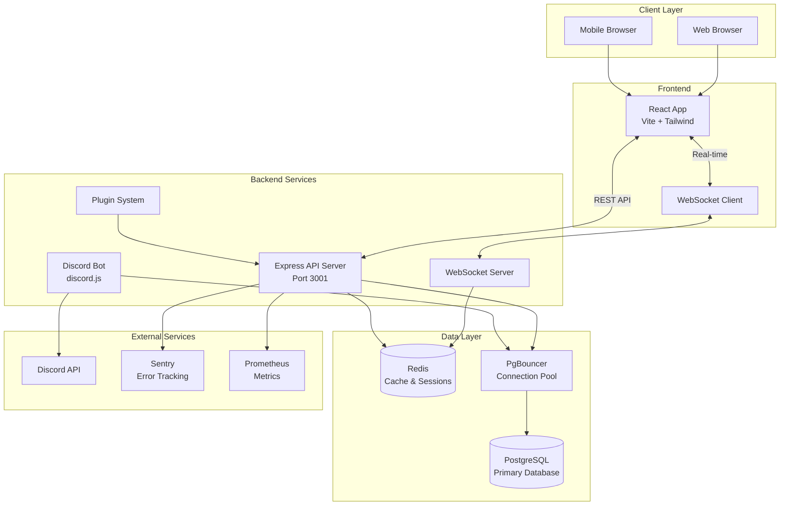
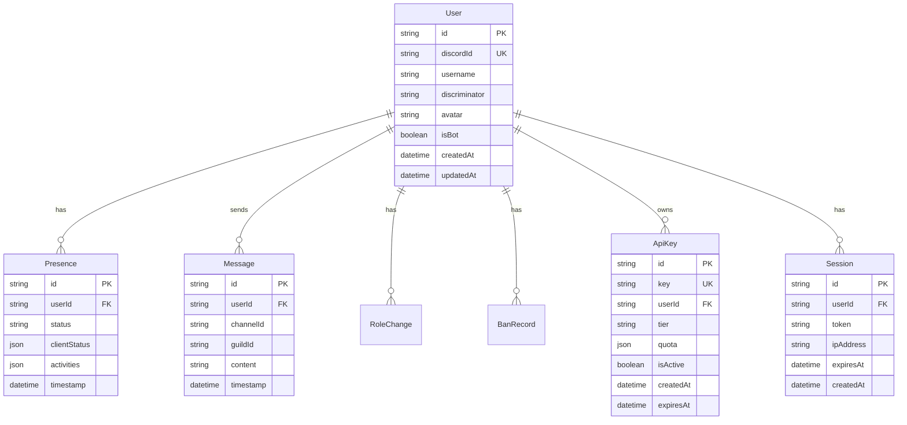
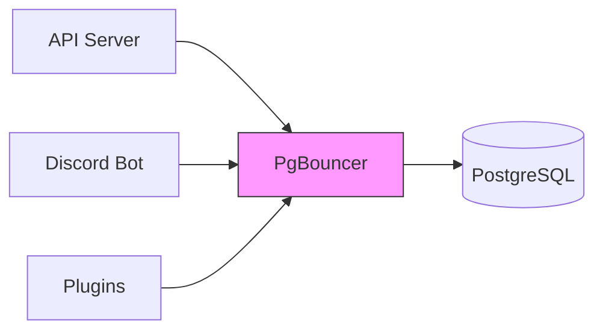
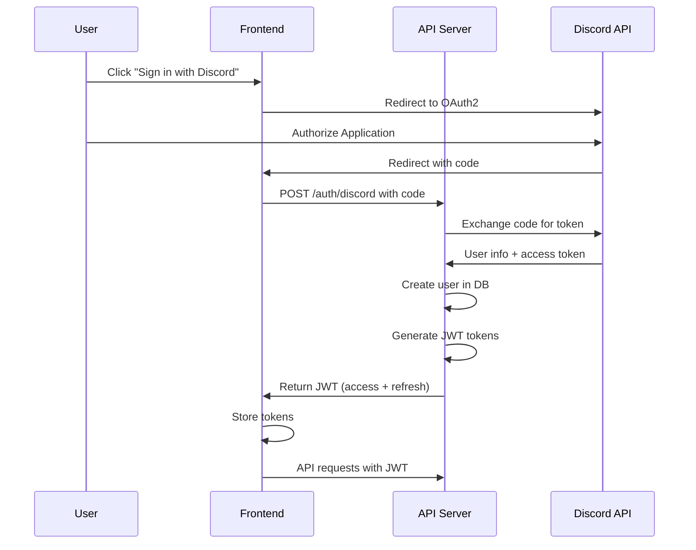
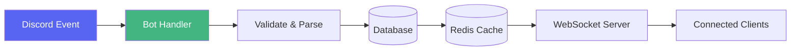
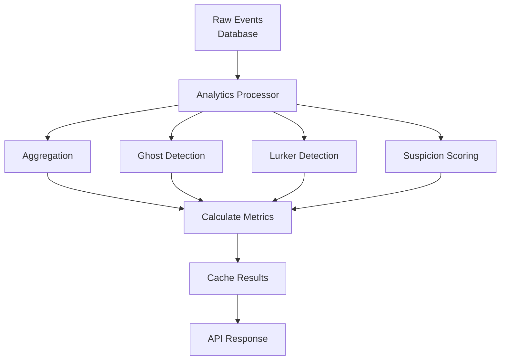
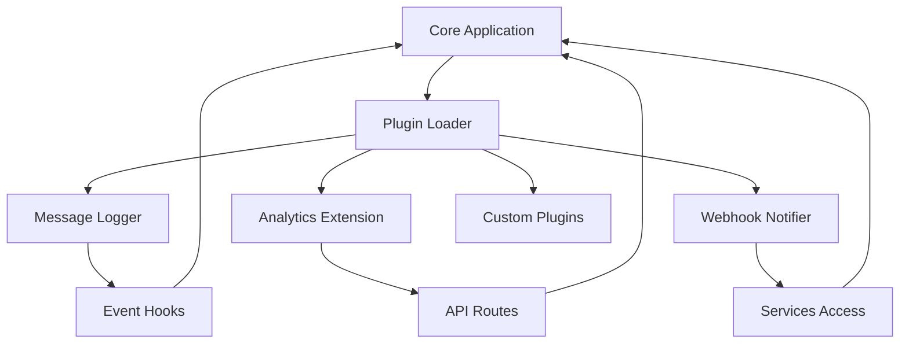
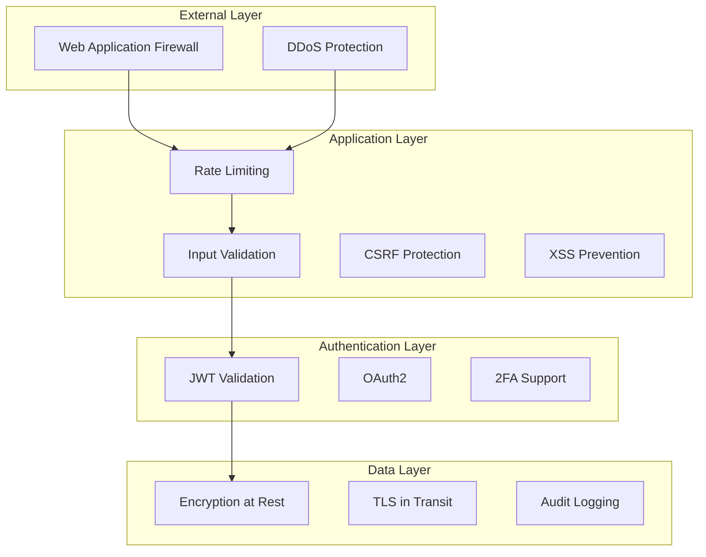
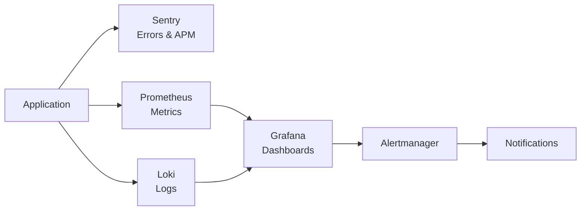
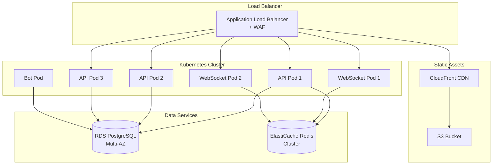

# System Architecture

## Overview

Spywatcher is a distributed application designed to monitor Discord server activity and provide analytics through a modern web interface. The system follows a microservices-inspired architecture with clear separation of concerns.

## High-Level Architecture



## Component Architecture

### Frontend Components

The frontend is built with React and organized into a component-based architecture:

```
frontend/src/
├── pages/          # Top-level route components
├── components/     # Reusable UI components
│   ├── charts/     # Data visualization
│   ├── layout/     # Layout components
│   └── ui/         # Basic UI elements
├── hooks/          # Custom React hooks
├── store/          # State management (Zustand)
├── lib/            # Utilities and API client
└── types/          # TypeScript definitions
```

**Key Technologies:**
- **React 18**: Component library with hooks
- **Vite**: Fast build tool and dev server
- **Tailwind CSS**: Utility-first styling
- **Recharts**: Data visualization
- **Zustand**: Lightweight state management
- **React Router**: Client-side routing

### Backend Services

The backend consists of multiple services running in separate processes:

#### 1. Discord Bot Service

**Purpose**: Monitor Discord server events and collect data

**Key Responsibilities:**
- Listen to presence updates (online/offline/idle)
- Track message events
- Monitor role changes
- Detect multi-client connections
- Write events to database

**Technologies:**
- discord.js v14
- TypeScript
- Prisma ORM

#### 2. API Server

**Purpose**: Provide REST API for frontend and third-party integrations

**Key Responsibilities:**
- Handle authentication (Discord OAuth2 + JWT)
- Serve analytics data
- Manage user preferences
- Rate limiting and security
- API key management
- Plugin lifecycle management

**Technologies:**
- Express.js
- TypeScript
- Prisma ORM
- JWT for sessions
- OpenAPI/Swagger docs

#### 3. WebSocket Server

**Purpose**: Provide real-time updates to connected clients

**Key Responsibilities:**
- Real-time presence updates
- Live analytics updates
- Event notifications
- Connection management

**Technologies:**
- Socket.io
- Redis for pub/sub
- JWT authentication

## Data Architecture

### Database Schema



### Caching Strategy

Redis is used for multiple caching layers:

1. **Session Cache**: JWT sessions and refresh tokens
2. **Rate Limiting**: Request counters and IP tracking
3. **Analytics Cache**: Frequently accessed metrics
4. **WebSocket State**: Active connections and subscriptions
5. **API Response Cache**: Expensive query results

**Cache Invalidation:**
- TTL-based expiration for most data
- Event-based invalidation for real-time updates
- Manual invalidation for admin operations

### Connection Pooling



**PgBouncer Configuration:**
- Transaction pooling mode for optimal performance
- 25 connections per service
- Statement timeout: 30 seconds
- Automatic connection recycling

## Authentication & Authorization

### Authentication Flow



### Authorization Layers

1. **JWT Validation**: Every API request validates JWT signature
2. **Role-Based Access**: Admin, moderator, user roles
3. **Permission System**: Granular permissions per resource
4. **Rate Limiting**: Per-user and per-IP limits
5. **API Key Authorization**: Separate auth for public API

## Data Flow

### Presence Monitoring Flow



**Steps:**
1. Discord emits presence update event
2. Bot receives and validates event data
3. Bot writes raw event to PostgreSQL
4. Bot updates Redis cache with latest state
5. WebSocket server detects cache update
6. WebSocket pushes update to subscribed clients

### Analytics Processing Flow



**Analytics Calculations:**
- **Ghost Score**: Presence time vs message activity
- **Lurker Score**: Time since last message
- **Suspicion Score**: Multi-client detection + behavior patterns
- **Activity Heatmap**: Time-based activity distribution
- **Role Drift**: Changes in role assignments over time

## Plugin Architecture

The plugin system allows extending functionality without modifying core code:



**Plugin Capabilities:**
- Hook into Discord events
- Register custom API routes
- Access database, cache, and services
- Subscribe to internal events
- Define custom permissions

See [Plugin System Guide](/guide/plugins) for details.

## Security Architecture

### Defense in Depth



**Security Features:**
1. **Input Validation**: Zod schemas for all inputs
2. **SQL Injection Prevention**: Prisma ORM parameterized queries
3. **XSS Prevention**: Content Security Policy + sanitization
4. **CSRF Protection**: Token-based validation
5. **Rate Limiting**: Redis-backed distributed limiting
6. **IP Blocking**: Automatic abuse detection
7. **Encryption**: TLS 1.3 for transport, AES-256 for data at rest
8. **Audit Logging**: All security events logged to Sentry

## Monitoring & Observability

### Monitoring Stack



**Metrics Collected:**
- Request rate, latency, error rate
- Database query performance
- Cache hit/miss rates
- WebSocket connection count
- Plugin execution time
- Resource utilization (CPU, memory, disk)

**Key Dashboards:**
- Application Performance
- Database Health
- API Usage & Rate Limits
- Security Events
- User Analytics

## Deployment Architecture

### Production Infrastructure



**Deployment Features:**
- **Auto-scaling**: HPA based on CPU/memory
- **Health checks**: Liveness and readiness probes
- **Rolling updates**: Zero-downtime deployments
- **Blue-green deployment**: Quick rollback capability
- **Canary deployment**: Gradual rollout with monitoring

## Performance Considerations

### Scalability

**Horizontal Scaling:**
- API servers: Scale based on request load
- WebSocket servers: Scale based on connection count
- Bot service: Single instance (Discord limitation)

**Vertical Scaling:**
- Database: RDS scaling for increased throughput
- Redis: ElastiCache cluster mode for larger datasets

### Optimization Strategies

1. **Database Indexing**: Strategic indexes on frequently queried fields
2. **Query Optimization**: Efficient joins and aggregations
3. **Connection Pooling**: PgBouncer for optimal connection reuse
4. **Caching**: Multi-layer caching with Redis
5. **CDN**: Static assets served via CloudFront
6. **Lazy Loading**: Frontend components loaded on demand
7. **Code Splitting**: Vite automatic bundle splitting

### Performance Metrics

**Target SLAs:**
- API Response Time: p95 < 200ms
- WebSocket Latency: p95 < 100ms
- Database Query Time: p95 < 50ms
- Uptime: 99.9%

## Disaster Recovery

### Backup Strategy

- **Database**: Daily full backups + continuous WAL archiving
- **Redis**: RDB snapshots every 6 hours
- **Configuration**: Git-based version control
- **Secrets**: Encrypted in AWS Secrets Manager

**Recovery Objectives:**
- RTO (Recovery Time Objective): < 4 hours
- RPO (Recovery Point Objective): < 1 hour

See [Disaster Recovery Guide](/admin/backup) for detailed procedures.

## Technology Stack Summary

| Layer | Technologies |
|-------|-------------|
| **Frontend** | React, TypeScript, Vite, Tailwind CSS, Zustand |
| **Backend** | Node.js, Express, TypeScript, Prisma |
| **Bot** | discord.js v14 |
| **Database** | PostgreSQL 14+, PgBouncer |
| **Cache** | Redis 6+ |
| **Monitoring** | Sentry, Prometheus, Grafana, Loki |
| **Deployment** | Docker, Kubernetes, Helm, Terraform |
| **CI/CD** | GitHub Actions |
| **Cloud** | AWS (EKS, RDS, ElastiCache, S3, CloudFront) |

## Next Steps

- [Database Schema Details](./database-schema)
- [API Architecture](./api-architecture)
- [Authentication Flow](./auth-flow)
- [WebSocket Architecture](./websocket)
- [Data Flow Details](./data-flow)
