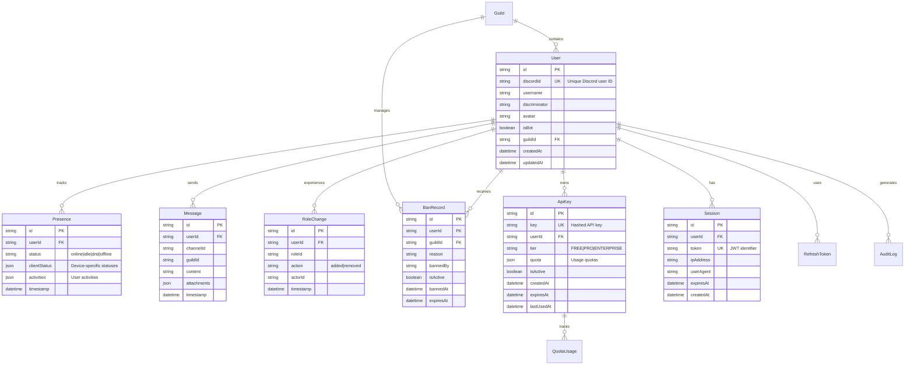

# Database Schema

Comprehensive documentation of the Spywatcher database schema, relationships, and design decisions.

## Overview

Spywatcher uses **PostgreSQL** as the primary database with **Prisma** as the ORM. The schema is designed for:

- **Performance**: Indexed fields for fast queries
- **Scalability**: Efficient relationships and data types
- **Data Integrity**: Foreign keys and constraints
- **Audit Trail**: Timestamps on all records

## Entity Relationship Diagram



## Core Tables

### User

Stores Discord user information.

```prisma
model User {
  id            String   @id @default(uuid())
  discordId     String   @unique
  username      String
  discriminator String
  avatar        String?
  isBot         Boolean  @default(false)
  guildId       String?
  
  // Relationships
  presences     Presence[]
  messages      Message[]
  roleChanges   RoleChange[]
  banRecords    BanRecord[]
  apiKeys       ApiKey[]
  sessions      Session[]
  refreshTokens RefreshToken[]
  auditLogs     AuditLog[]
  
  // Timestamps
  createdAt DateTime @default(now())
  updatedAt DateTime @updatedAt
  
  // Indexes
  @@index([guildId])
  @@index([username])
  @@index([createdAt])
}
```

**Key Fields:**
- `discordId`: Unique Discord user identifier
- `username`: Discord username (can change)
- `discriminator`: Four-digit discriminator (legacy)
- `avatar`: Avatar hash from Discord
- `isBot`: Whether this is a bot user
- `guildId`: Associated guild (optional)

**Indexes:**
- `discordId` (unique): Fast lookups by Discord ID
- `guildId`: Filter users by guild
- `username`: Search users by name
- `createdAt`: Sort by join date

### Presence

Tracks user presence updates from Discord.

```prisma
model Presence {
  id           String   @id @default(uuid())
  userId       String
  status       String   // "online" | "idle" | "dnd" | "offline"
  clientStatus Json?    // { web?: string, mobile?: string, desktop?: string }
  activities   Json?    // Array of activity objects
  timestamp    DateTime @default(now())
  
  user User @relation(fields: [userId], references: [id], onDelete: Cascade)
  
  @@index([userId, timestamp])
  @@index([status])
  @@index([timestamp])
}
```

**Key Fields:**
- `status`: Overall presence status
- `clientStatus`: Per-device status (detects multi-client usage)
- `activities`: Rich presence data (games, Spotify, custom status)
- `timestamp`: When the presence was recorded

**Design Decisions:**
- Store complete presence snapshots for analysis
- Use JSON for flexible activity data
- Composite index on `userId + timestamp` for time-series queries
- Cascade delete when user is removed

**Example Query:**
```typescript
// Get user's presence history
const presences = await prisma.presence.findMany({
  where: {
    userId: 'user123',
    timestamp: {
      gte: new Date('2024-01-01'),
      lte: new Date('2024-01-31'),
    },
  },
  orderBy: { timestamp: 'desc' },
});
```

### Message

Stores Discord message metadata.

```prisma
model Message {
  id          String   @id @default(uuid())
  userId      String
  channelId   String
  guildId     String
  content     String   @db.Text
  attachments Json?
  timestamp   DateTime @default(now())
  
  user User @relation(fields: [userId], references: [id], onDelete: Cascade)
  
  @@index([userId, timestamp])
  @@index([channelId])
  @@index([guildId])
  @@index([timestamp])
}
```

**Key Fields:**
- `content`: Message text content
- `channelId`: Discord channel identifier
- `guildId`: Discord guild (server) identifier
- `attachments`: JSON array of attachment metadata

**Privacy Considerations:**
- Message content should be handled according to privacy policy
- Consider data retention policies
- Implement opt-out mechanisms

### RoleChange

Tracks role assignment changes.

```prisma
model RoleChange {
  id        String   @id @default(uuid())
  userId    String
  roleId    String
  action    String   // "added" | "removed"
  actorId   String?  // Who made the change
  timestamp DateTime @default(now())
  
  user User @relation(fields: [userId], references: [id], onDelete: Cascade)
  
  @@index([userId, timestamp])
  @@index([roleId])
}
```

**Use Cases:**
- Detect role drift (users gaining/losing permissions)
- Audit role changes
- Identify suspicious permission escalations

## Authentication & Authorization Tables

### Session

Stores active user sessions (JWT-based).

```prisma
model Session {
  id        String   @id @default(uuid())
  userId    String
  token     String   @unique  // JWT identifier (jti)
  ipAddress String?
  userAgent String?
  expiresAt DateTime
  createdAt DateTime @default(now())
  
  user User @relation(fields: [userId], references: [id], onDelete: Cascade)
  
  @@index([userId])
  @@index([expiresAt])
  @@index([token])
}
```

**Session Management:**
- Store JWT identifier for validation
- Track IP and user agent for security
- Auto-expire based on `expiresAt`
- Support session revocation

### RefreshToken

Stores refresh tokens for session renewal.

```prisma
model RefreshToken {
  id        String   @id @default(uuid())
  userId    String
  token     String   @unique
  expiresAt DateTime
  createdAt DateTime @default(now())
  
  user User @relation(fields: [userId], references: [id], onDelete: Cascade)
  
  @@index([userId])
  @@index([token])
}
```

**Security:**
- Tokens are hashed before storage
- One-time use (rotate on use)
- Longer expiration than access tokens
- Revocable for logout

### ApiKey

Stores API keys for programmatic access.

```prisma
model ApiKey {
  id         String   @id @default(uuid())
  key        String   @unique  // Hashed API key
  userId     String
  name       String?
  tier       String   @default("FREE")  // FREE | PRO | ENTERPRISE
  quota      Json     // Per-tier quotas
  isActive   Boolean  @default(true)
  createdAt  DateTime @default(now())
  expiresAt  DateTime?
  lastUsedAt DateTime?
  
  user        User          @relation(fields: [userId], references: [id], onDelete: Cascade)
  quotaUsage  QuotaUsage[]
  
  @@index([userId])
  @@index([key])
  @@index([isActive])
}
```

**Quota Structure:**
```json
{
  "analytics": {
    "daily": 1000,
    "monthly": 30000
  },
  "users": {
    "daily": 500,
    "monthly": 15000
  }
}
```

### QuotaUsage

Tracks API key usage for rate limiting.

```prisma
model QuotaUsage {
  id        String   @id @default(uuid())
  apiKeyId  String
  endpoint  String
  count     Int      @default(1)
  date      DateTime @default(now()) @db.Date
  
  apiKey ApiKey @relation(fields: [apiKeyId], references: [id], onDelete: Cascade)
  
  @@unique([apiKeyId, endpoint, date])
  @@index([apiKeyId, date])
  @@index([date])
}
```

**Usage Tracking:**
- Increment counters per endpoint per day
- Reset daily quotas at midnight UTC
- Check limits before processing requests

## Moderation Tables

### BanRecord

Stores user ban information.

```prisma
model BanRecord {
  id        String    @id @default(uuid())
  userId    String
  guildId   String
  reason    String?
  bannedBy  String
  isActive  Boolean   @default(true)
  bannedAt  DateTime  @default(now())
  expiresAt DateTime?
  unbannedAt DateTime?
  unbannedBy String?
  
  user User @relation(fields: [userId], references: [id], onDelete: Cascade)
  
  @@index([userId])
  @@index([guildId])
  @@index([isActive])
}
```

**Ban Types:**
- Permanent: `expiresAt` is null
- Temporary: `expiresAt` is set
- IP bans stored separately

### IpBlock

Stores blocked IP addresses.

```prisma
model IpBlock {
  id        String   @id @default(uuid())
  ipAddress String   @unique
  reason    String?
  blockedBy String
  blockedAt DateTime @default(now())
  expiresAt DateTime?
  
  @@index([ipAddress])
  @@index([expiresAt])
}
```

## Audit & Logging Tables

### AuditLog

Comprehensive audit trail for security events.

```prisma
model AuditLog {
  id        String   @id @default(uuid())
  userId    String?
  action    String   // "login", "api_key_created", "ban_created", etc.
  resource  String?  // Affected resource type
  resourceId String? // Affected resource ID
  details   Json?    // Additional context
  ipAddress String?
  userAgent String?
  timestamp DateTime @default(now())
  
  user User? @relation(fields: [userId], references: [id], onDelete: SetNull)
  
  @@index([userId, timestamp])
  @@index([action])
  @@index([timestamp])
  @@index([ipAddress])
}
```

**Logged Events:**
- Authentication (login, logout, failed attempts)
- Authorization (permission denials)
- Data access (sensitive data queries)
- Configuration changes
- Administrative actions

## Performance Indexes

### Strategic Indexing

```sql
-- High-frequency queries
CREATE INDEX idx_presence_user_time ON "Presence" ("userId", "timestamp" DESC);
CREATE INDEX idx_message_user_time ON "Message" ("userId", "timestamp" DESC);

-- Filtering and sorting
CREATE INDEX idx_user_guild ON "User" ("guildId");
CREATE INDEX idx_presence_status ON "Presence" ("status");

-- Time-based queries
CREATE INDEX idx_presence_timestamp ON "Presence" ("timestamp");
CREATE INDEX idx_message_timestamp ON "Message" ("timestamp");

-- Full-text search (optional)
CREATE INDEX idx_user_username_gin ON "User" USING gin(to_tsvector('english', username));
```

### Query Optimization

**Composite Indexes:**
- `(userId, timestamp)`: Fast user history queries
- `(apiKeyId, date)`: Efficient quota checks
- `(guildId, status)`: Filter by guild and status

**Covering Indexes:**
Consider adding covering indexes for frequent queries:

```sql
CREATE INDEX idx_presence_covering 
ON "Presence" ("userId", "timestamp", "status", "clientStatus");
```

## Data Retention

### Retention Policies

```typescript
// Example retention configuration
const retentionPolicies = {
  presence: '90 days',      // Presence records
  message: '30 days',       // Message metadata
  auditLog: '1 year',       // Audit logs
  session: 'on expiry',     // Sessions
  banRecord: 'permanent',   // Ban history
};
```

### Automated Cleanup

```sql
-- Delete old presence records
DELETE FROM "Presence" 
WHERE timestamp < NOW() - INTERVAL '90 days';

-- Delete expired sessions
DELETE FROM "Session" 
WHERE "expiresAt" < NOW();

-- Archive old audit logs
INSERT INTO "AuditLogArchive" 
SELECT * FROM "AuditLog" 
WHERE timestamp < NOW() - INTERVAL '1 year';

DELETE FROM "AuditLog" 
WHERE timestamp < NOW() - INTERVAL '1 year';
```

## Migrations

### Creating Migrations

```bash
# Create a new migration
npx prisma migrate dev --name add_user_preferences

# Apply migrations to production
npx prisma migrate deploy

# Reset database (development only)
npx prisma migrate reset
```

### Migration Best Practices

1. **Test thoroughly** in development
2. **Backup** before applying to production
3. **Make migrations reversible** when possible
4. **Document** breaking changes
5. **Monitor** performance after deployment

### Example Migration

```sql
-- Add new column with default
ALTER TABLE "User" 
ADD COLUMN "preferences" JSONB DEFAULT '{}';

-- Create index
CREATE INDEX idx_user_preferences 
ON "User" USING gin("preferences");

-- Backfill data (if needed)
UPDATE "User" 
SET "preferences" = '{"theme": "dark", "notifications": true}' 
WHERE "preferences" IS NULL;
```

## Database Maintenance

### Regular Tasks

```bash
# Vacuum and analyze
VACUUM ANALYZE;

# Reindex tables
REINDEX TABLE "Presence";
REINDEX TABLE "Message";

# Update statistics
ANALYZE "User";
ANALYZE "Presence";

# Check table sizes
SELECT 
  tablename,
  pg_size_pretty(pg_total_relation_size(schemaname||'.'||tablename)) AS size
FROM pg_tables 
WHERE schemaname = 'public'
ORDER BY pg_total_relation_size(schemaname||'.'||tablename) DESC;
```

### Monitoring Queries

```sql
-- Find slow queries
SELECT 
  query,
  calls,
  total_time,
  mean_time
FROM pg_stat_statements
ORDER BY mean_time DESC
LIMIT 10;

-- Check index usage
SELECT 
  schemaname,
  tablename,
  indexname,
  idx_scan,
  idx_tup_read,
  idx_tup_fetch
FROM pg_stat_user_indexes
WHERE idx_scan = 0
ORDER BY pg_relation_size(indexrelid) DESC;
```

## Connection Pooling

See [Connection Pooling Guide](/admin/connection-pooling) for:
- PgBouncer configuration
- Connection pool sizing
- Performance optimization
- Monitoring and troubleshooting

## Backup & Recovery

See [Backup Guide](/admin/backup) for:
- Automated backup strategies
- Point-in-time recovery (PITR)
- WAL archiving
- Restore procedures

## Related Documentation

- [Architecture Overview](./architecture)
- [API Architecture](./api-architecture)
- [Data Flow](./data-flow)
- [Performance Optimization](/admin/performance)
