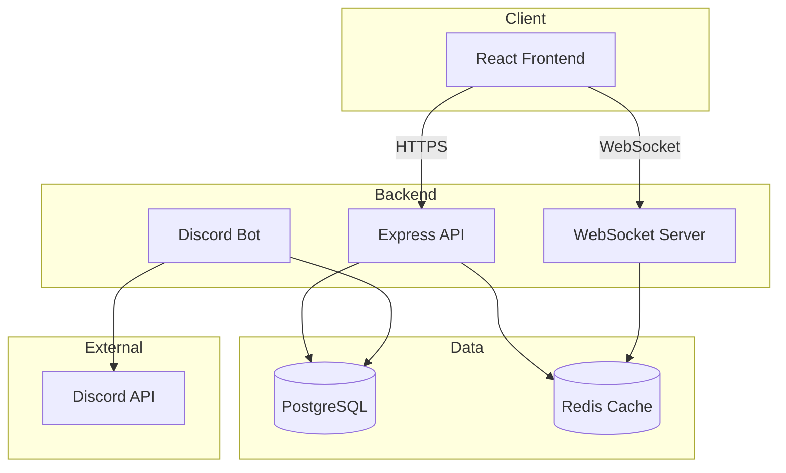

# Developer Guide

Welcome to the Spywatcher Developer Guide! This guide will help you set up your development environment, understand the architecture, and contribute to the project.

## Overview

Spywatcher is a full-stack Discord surveillance and analytics application built with:

- **Backend**: Node.js, Express, TypeScript, Prisma
- **Frontend**: React, Vite, Tailwind CSS
- **Database**: PostgreSQL
- **Cache**: Redis
- **Bot**: discord.js

## Quick Start for Developers

### 1. Prerequisites

Ensure you have installed:

- **Node.js**: v18+ ([Download](https://nodejs.org/))
- **npm**: v8+ (comes with Node.js)
- **Git**: Version control
- **PostgreSQL**: v14+ (or use Docker)
- **Redis**: v6+ (or use Docker)
- **Docker** (optional but recommended)

### 2. Clone and Install

```bash
# Clone repository
git clone https://github.com/subculture-collective/discord-spywatcher.git
cd discord-spywatcher

# Install root dependencies (git hooks, etc.)
npm install

# Install backend dependencies
cd backend
npm install

# Install frontend dependencies
cd ../frontend
npm install
```

### 3. Set Up Environment

```bash
# Copy example environment files
cp .env.example .env
cp backend/.env.example backend/.env
cp frontend/.env.example frontend/.env
```

Edit the files with your Discord credentials and database URLs.

### 4. Start Development

**Option A: Using Docker (Recommended)**

```bash
# Start all services
docker-compose -f docker-compose.dev.yml up
```

**Option B: Manual Start**

```bash
# Terminal 1: Start PostgreSQL and Redis (if not using Docker)
# Terminal 2: Start Discord bot
cd backend
npm run dev

# Terminal 3: Start API server
cd backend
npm run dev:api

# Terminal 4: Start frontend
cd frontend
npm run dev
```

## Development Workflow

### Git Workflow

1. **Fork** the repository
2. **Clone** your fork
3. **Create** a feature branch: `git checkout -b feature/your-feature`
4. **Make** changes and commit with conventional commits
5. **Push** to your fork
6. **Create** a Pull Request

### Commit Convention

We use [Conventional Commits](https://www.conventionalcommits.org/):

```bash
feat: add ghost detection API endpoint
fix: resolve WebSocket connection issue
docs: update installation guide
test: add integration tests for analytics
refactor: simplify suspicion scoring logic
chore: update dependencies
```

### Code Quality

Before committing, ensure:

```bash
# Run linters
npm run lint

# Fix linting issues
npm run lint:fix

# Format code
npm run format

# Type check
npm run type-check

# Run tests
npm test
```

### Git Hooks

Pre-commit hooks automatically run:
- ESLint on changed files
- Prettier on changed files
- Type checking

Commit message hooks validate:
- Conventional commit format
- Message length and structure

## Project Structure

```
discord-spywatcher/
├── backend/              # Backend services
│   ├── src/
│   │   ├── index.ts      # Discord bot entry
│   │   ├── server.ts     # API server entry
│   │   ├── routes/       # API routes
│   │   ├── services/     # Business logic
│   │   ├── middleware/   # Express middleware
│   │   ├── analytics/    # Analytics engine
│   │   └── types/        # TypeScript types
│   ├── prisma/           # Database schema
│   ├── __tests__/        # Tests
│   └── plugins/          # Plugin system
├── frontend/             # React frontend
│   ├── src/
│   │   ├── pages/        # Page components
│   │   ├── components/   # Reusable components
│   │   ├── hooks/        # Custom React hooks
│   │   ├── store/        # State management
│   │   ├── lib/          # Utilities
│   │   └── types/        # TypeScript types
│   └── e2e/              # E2E tests
├── docs/                 # Documentation (VitePress)
├── sdk/                  # TypeScript SDK
├── scripts/              # Utility scripts
├── k8s/                  # Kubernetes configs
├── terraform/            # Infrastructure as code
└── docker-compose.*.yml  # Docker configs
```

## Key Concepts

### Architecture Overview



### Authentication Flow

1. User clicks "Sign in with Discord"
2. Redirects to Discord OAuth2
3. User authorizes application
4. Discord redirects back with code
5. Backend exchanges code for access token
6. Backend creates JWT session token
7. Frontend stores JWT and uses for API calls

### Data Flow

1. **Discord Bot** listens for presence and message events
2. **Bot** writes events to PostgreSQL
3. **Analytics Engine** processes raw data into metrics
4. **API Server** serves metrics to frontend
5. **Frontend** displays analytics
6. **WebSocket** pushes real-time updates

## Testing

### Backend Tests

```bash
cd backend

# Run all tests
npm test

# Run unit tests only
npm run test:unit

# Run integration tests
npm run test:integration

# Run with coverage
npm run test:coverage

# Watch mode
npm run test:watch
```

### Frontend Tests

```bash
cd frontend

# Run unit tests
npm test

# Run E2E tests
npm run test:e2e

# Run with coverage
npm run test:coverage
```

### Writing Tests

**Unit Test Example** (`backend/__tests__/unit/analytics.test.ts`):

```typescript
import { calculateGhostScore } from '../../src/analytics/ghost';

describe('Ghost Score Calculation', () => {
  it('should calculate ghost score correctly', () => {
    const score = calculateGhostScore(100, 5);
    expect(score).toBe(16.67);
  });

  it('should handle zero messages', () => {
    const score = calculateGhostScore(100, 0);
    expect(score).toBe(100);
  });
});
```

**Integration Test Example** (`backend/__tests__/integration/api.test.ts`):

```typescript
import request from 'supertest';
import { app } from '../../src/server';

describe('Analytics API', () => {
  it('GET /api/analytics returns analytics data', async () => {
    const response = await request(app)
      .get('/api/analytics')
      .set('Authorization', `Bearer ${testToken}`)
      .expect(200);

    expect(response.body).toHaveProperty('totalUsers');
    expect(response.body).toHaveProperty('activeUsers');
  });
});
```

## API Development

### Creating a New Endpoint

1. **Define Route** (`backend/src/routes/myFeature.ts`):

```typescript
import { Router } from 'express';
import { authenticate } from '../middleware/auth';

const router = Router();

router.get('/my-feature', authenticate, async (req, res) => {
  try {
    const data = await getMyFeatureData(req.user.id);
    res.json(data);
  } catch (error) {
    res.status(500).json({ error: 'Internal server error' });
  }
});

export default router;
```

2. **Add Service Logic** (`backend/src/services/myFeature.ts`):

```typescript
import { prisma } from '../config/database';

export async function getMyFeatureData(userId: string) {
  const data = await prisma.myFeature.findMany({
    where: { userId },
  });
  return data;
}
```

3. **Register Route** (`backend/src/server.ts`):

```typescript
import myFeatureRouter from './routes/myFeature';
app.use('/api/my-feature', myFeatureRouter);
```

4. **Add Tests**
5. **Update OpenAPI Spec**
6. **Update Documentation**

## Database Development

### Schema Changes

1. **Edit Prisma Schema** (`backend/prisma/schema.prisma`):

```prisma
model MyNewModel {
  id        String   @id @default(uuid())
  userId    String
  data      Json
  createdAt DateTime @default(now())
  
  user User @relation(fields: [userId], references: [id])
  
  @@index([userId])
}
```

2. **Create Migration**:

```bash
cd backend
npx prisma migrate dev --name add_my_new_model
```

3. **Generate Client**:

```bash
npx prisma generate
```

### Database Queries

Use Prisma Client for type-safe queries:

```typescript
// Find many with relations
const users = await prisma.user.findMany({
  where: {
    isActive: true,
  },
  include: {
    presences: true,
    messages: true,
  },
  orderBy: {
    createdAt: 'desc',
  },
});

// Aggregations
const stats = await prisma.presence.aggregate({
  where: {
    userId: userId,
  },
  _count: true,
  _avg: {
    duration: true,
  },
});
```

## Frontend Development

### Creating a New Page

1. **Create Page Component** (`frontend/src/pages/MyFeature.tsx`):

```tsx
import React from 'react';
import { useMyFeature } from '../hooks/useMyFeature';

export default function MyFeature() {
  const { data, loading, error } = useMyFeature();

  if (loading) return <Loading />;
  if (error) return <Error message={error} />;

  return (
    <div className="container mx-auto p-4">
      <h1 className="text-2xl font-bold">My Feature</h1>
      {/* Your component JSX */}
    </div>
  );
}
```

2. **Create Custom Hook** (`frontend/src/hooks/useMyFeature.ts`):

```typescript
import { useState, useEffect } from 'react';
import { api } from '../lib/api';

export function useMyFeature() {
  const [data, setData] = useState(null);
  const [loading, setLoading] = useState(true);
  const [error, setError] = useState(null);

  useEffect(() => {
    async function fetchData() {
      try {
        const result = await api.get('/my-feature');
        setData(result.data);
      } catch (err) {
        setError(err.message);
      } finally {
        setLoading(false);
      }
    }
    fetchData();
  }, []);

  return { data, loading, error };
}
```

3. **Add Route** (`frontend/src/App.tsx`):

```tsx
import MyFeature from './pages/MyFeature';

<Route path="/my-feature" element={<MyFeature />} />
```

## Debugging

### Backend Debugging

**VS Code Configuration** (`.vscode/launch.json`):

```json
{
  "version": "0.2.0",
  "configurations": [
    {
      "type": "node",
      "request": "launch",
      "name": "Debug Backend",
      "runtimeExecutable": "npm",
      "runtimeArgs": ["run", "dev:api"],
      "cwd": "${workspaceFolder}/backend",
      "skipFiles": ["<node_internals>/**"]
    }
  ]
}
```

### Frontend Debugging

Use React DevTools and browser developer tools:
- Install [React Developer Tools](https://react.dev/learn/react-developer-tools)
- Use browser console for debugging
- Enable React DevTools Profiler for performance

### Database Debugging

```bash
# View current schema
npx prisma db pull

# Open Prisma Studio (GUI)
npx prisma studio

# View migration status
npx prisma migrate status
```

## Documentation

When adding features, update:

1. **Code Comments**: JSDoc for functions
2. **README Files**: Update relevant READMEs
3. **API Documentation**: Update OpenAPI spec
4. **User Guide**: Add user-facing documentation
5. **Developer Guide**: Add technical details

## Resources

- **[Architecture Guide](./architecture)** - System design details
- **[API Architecture](./api-architecture)** - API design patterns
- **[Database Schema](./database-schema)** - Database structure
- **[Contributing Guide](./contributing)** - Contribution guidelines
- **[Testing Guide](./testing)** - Testing strategies

## Next Steps

1. **[Set up your environment](./local-environment)**
2. **[Understand the architecture](./architecture)**
3. **[Run the tests](./testing)**
4. **[Read the contributing guide](./contributing)**
5. **[Start coding!](./contributing)**

---

::: tip Getting Help
Join our development discussions on GitHub or open an issue if you need help!
:::
