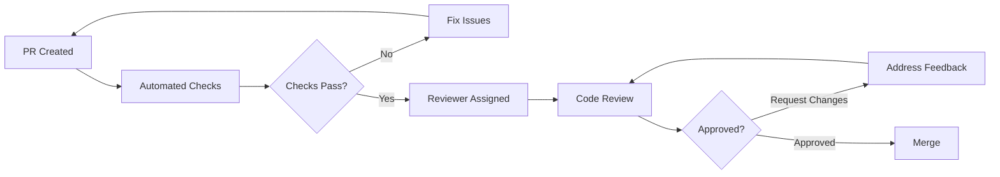

# Code Review Process

Guidelines for effective code reviews in the Spywatcher project.

## Overview

Code reviews are essential for:

- Maintaining code quality
- Sharing knowledge
- Catching bugs early
- Ensuring consistency
- Improving skills

## Review Workflow



## For Reviewers

### What to Review

#### 1. Functionality

- [ ] Code does what it's supposed to do
- [ ] Handles edge cases
- [ ] No obvious bugs
- [ ] Backward compatible (or documented breaking changes)

#### 2. Code Quality

- [ ] Follows [code style guide](./code-style)
- [ ] No code smells or anti-patterns
- [ ] Proper error handling
- [ ] No hardcoded values
- [ ] DRY principle followed

#### 3. Tests

- [ ] Adequate test coverage
- [ ] Tests actually test behavior
- [ ] Edge cases covered
- [ ] Tests are maintainable

#### 4. Documentation

- [ ] Code comments where needed (not obvious)
- [ ] API docs updated
- [ ] README updated if needed
- [ ] Migration guide for breaking changes

#### 5. Security

- [ ] Input validation
- [ ] No SQL injection vulnerabilities
- [ ] No XSS vulnerabilities
- [ ] Secrets not committed
- [ ] Proper authentication/authorization

#### 6. Performance

- [ ] No obvious performance issues
- [ ] Efficient algorithms
- [ ] Proper indexing (database)
- [ ] Caching where appropriate

### Review Checklist

**Before Starting:**

- [ ] Read PR description
- [ ] Understand the context
- [ ] Check related issues
- [ ] Pull and run code locally (if needed)

**During Review:**

- [ ] Read code changes carefully
- [ ] Look for potential issues
- [ ] Consider alternatives
- [ ] Check tests
- [ ] Verify documentation

**After Review:**

- [ ] Provide clear feedback
- [ ] Suggest improvements
- [ ] Approve or request changes
- [ ] Follow up on feedback

### Providing Feedback

#### Be Constructive

✅ **Good:**

````markdown
This function could be simplified using array.reduce().
Here's an example:

```typescript
const sum = numbers.reduce((acc, num) => acc + num, 0);
```
````

This is more concise and easier to understand.

````

❌ **Bad:**
```markdown
This code is bad. Rewrite it.
````

#### Be Specific

✅ **Good:**

```markdown
Line 45: This should use `===` instead of `==` for type-safe comparison.
Line 52: Consider extracting this logic into a separate function for better testability.
```

❌ **Bad:**

```markdown
Fix the comparisons and refactor.
```

#### Explain Why

✅ **Good:**

```markdown
Consider using a Map instead of an object here:

- Faster key lookups for large datasets
- Preserves insertion order
- Handles non-string keys

However, an object is fine if simplicity is preferred.
```

❌ **Bad:**

```markdown
Use a Map.
```

### Review Types

**1. Approve ✅**

- Ready to merge
- All concerns addressed
- Meets quality standards

**2. Request Changes ❌**

- Issues must be fixed before merge
- Be specific about what needs to change
- Explain why changes are needed

**3. Comment 💬**

- Suggestions but not blocking
- Questions for clarification
- General feedback

### Time Expectations

- **Small PRs** (<100 lines): Review within 1 day
- **Medium PRs** (100-500 lines): Review within 2 days
- **Large PRs** (>500 lines): Review within 3-5 days

If you can't review in time:

- Let the author know
- Request another reviewer
- Suggest breaking into smaller PRs

## For Authors

### Preparing for Review

**Before Creating PR:**

- [ ] Run all tests
- [ ] Check code style
- [ ] Self-review your changes
- [ ] Write clear PR description
- [ ] Add relevant reviewers

**PR Description Should Include:**

- What changed and why
- How to test
- Screenshots (if UI changes)
- Breaking changes (if any)
- Related issues

### Responding to Feedback

#### When Reviewer Comments

1. **Read carefully**: Understand the feedback
2. **Discuss if needed**: Ask questions if unclear
3. **Make changes**: Address valid concerns
4. **Reply**: Let reviewer know when addressed
5. **Re-request review**: When ready for another look

#### Example Response

```markdown
> Consider using a Set instead of array for O(1) lookups

Good catch! I've refactored this to use a Set.
The performance improvement is significant with large datasets.

Updated in commit abc123.
```

#### Disagreeing Respectfully

```markdown
> I think we should use approach X instead of Y

I considered approach X, but chose Y because:

1. Better fits our use case
2. Simpler to maintain
3. Better performance for our data size

However, I'm open to using X if you think the benefits outweigh these concerns. What do you think?
```

### Handling Multiple Rounds

**If Many Changes Requested:**

- Make changes incrementally
- Commit after each logical change
- Reply to each comment when addressed
- Don't take feedback personally

**If Stuck:**

- Ask for clarification
- Request pairing session
- Reach out to maintainers

## Best Practices

### For Everyone

**1. Be Respectful**

- Everyone is trying their best
- Focus on the code, not the person
- Assume good intentions

**2. Be Timely**

- Review promptly
- Respond to feedback quickly
- Don't leave PRs hanging

**3. Be Thorough**

- Don't rush reviews
- Check all aspects
- Test locally if needed

**4. Be Collaborative**

- Share knowledge
- Learn from each other
- Help improve the codebase

### Common Pitfalls to Avoid

❌ **Nitpicking**: Don't focus on trivial style issues (use linter)
❌ **Scope Creep**: Don't ask for unrelated changes
❌ **Being Vague**: Always be specific
❌ **Being Harsh**: Always be constructive
❌ **Rubber Stamping**: Don't approve without reviewing
❌ **Blocking on Opinions**: Distinguish between issues and preferences

## Automated Checks

Before human review, automated checks run:

1. **Linting**: ESLint checks code style
2. **Type Checking**: TypeScript compilation
3. **Tests**: Full test suite
4. **Build**: Production build verification
5. **Security**: CodeQL analysis

All must pass before merge.

## Review Tools

- **GitHub PR Interface**: Main review tool
- **VS Code**: Review PR extension
- **GitHub CLI**: `gh pr review`

## Escalation

If disagreement can't be resolved:

1. Discuss in PR comments
2. Tag a maintainer
3. Schedule a call if needed
4. Maintainer makes final decision

## Metrics

Track review quality:

- Average time to first review
- Number of review rounds
- Bugs caught in review
- Time to merge after approval

## Resources

- [Pull Request Guide](./pull-requests)
- [Code Style Guide](./code-style)
- [Contributing Guide](./contributing)
- [How to Review Code](https://google.github.io/eng-practices/review/reviewer/)

## Questions?

- Ask in PR comments
- Join [GitHub Discussions](https://github.com/subculture-collective/discord-spywatcher/discussions)
- Reach out to maintainers
